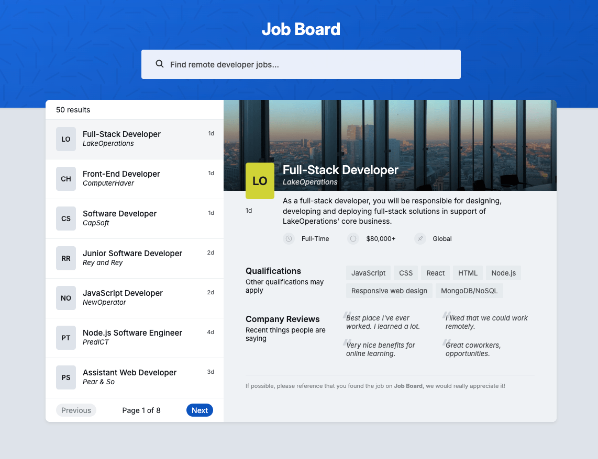

# React Job Board

A job board application that allows users to search and paginate through job listings. Search input is debounced using a custom hook for efficient querying as users type, and paginated results are fetched via React Query. The project includes unit tests written with Vitest. Built with React, TypeScript, and React Query.

## Live Demo

[https://mikebostone.com/projects/react-job-board/](https://mikebostone.com/projects/react-job-board/)

## Screenshots

